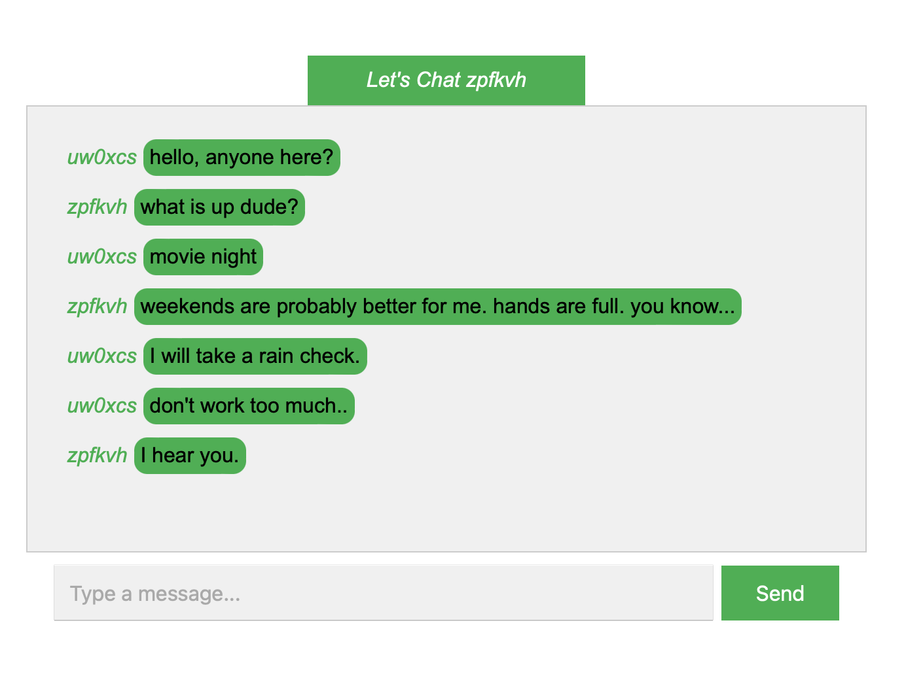

# chat-room in Javascript
an improved UI real-time chat room application using JavaScript and WebSockets 
involves both client-side and server-side code

# Node.js  # express.js  # websocket.js
How It Works:

WebSocket connection: The client (browser) establishes a WebSocket connection to the server.

Broadcasting messages: When a client sends a message, the server broadcasts it to all connected clients.

Real-time updates: All clients receive messages in real-time without the need to refresh the page.

User name assignment: All clients receive a unique user name

